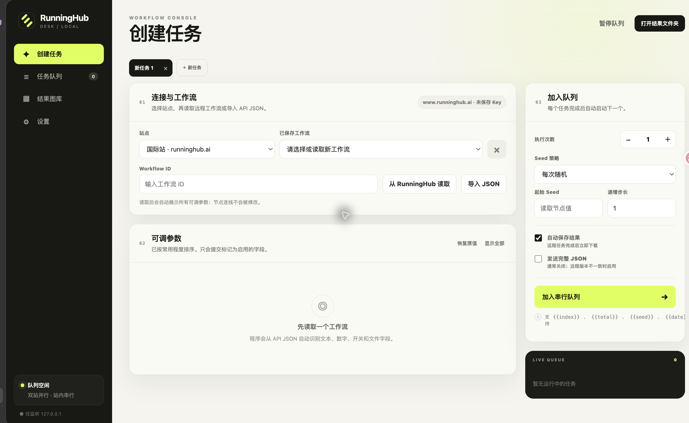
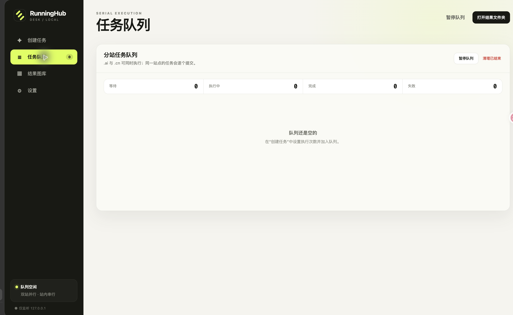
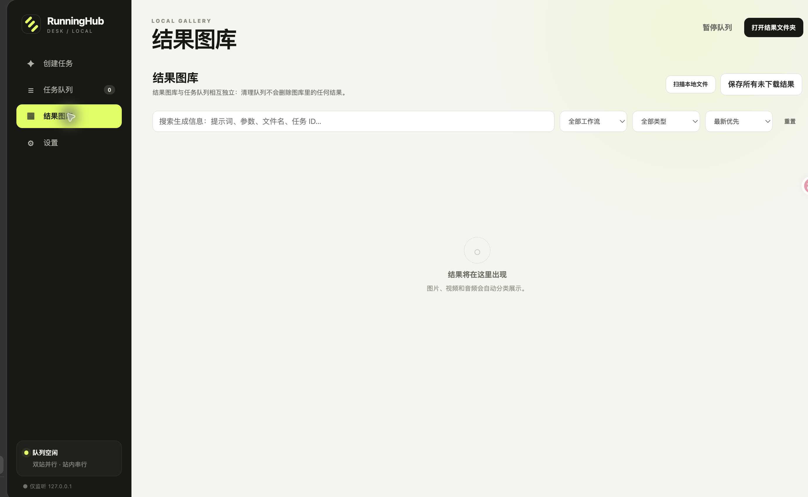
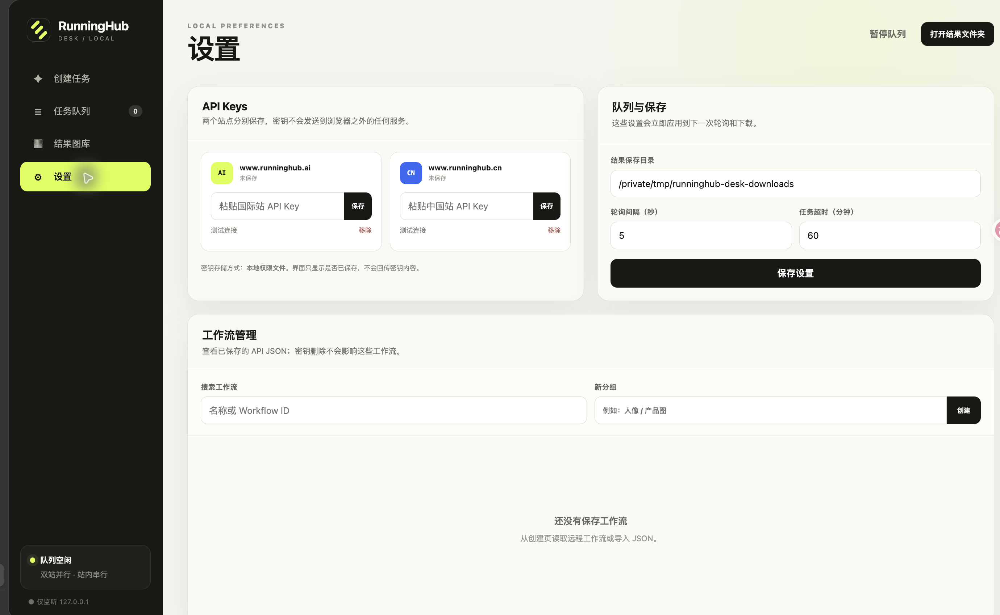

# RunningHub Desk

一个本地运行的 RunningHub 工作流工作台。它面向需要连续生成、频繁调参和长期保存结果的个人用户，不需要安装 Node.js，也不需要额外 Python 包。

## 页面预览

所有页面都在本机运行，下面的截图使用空白数据目录生成，不包含 API Key、任务记录或本地文件。

<p>
  
  
</p>
<p>
  
  
</p>

## 主要功能

- `www.runninghub.ai` 与 `www.runninghub.cn` 双站点切换，API Key 分开保存。
- macOS 上使用系统钥匙串保存密钥；其他系统使用本地密钥文件（详见“数据位置”）。
- 从 RunningHub 读取 Workflow API JSON，或直接导入本地 JSON。
- 工作流支持自定义名称、搜索和分组管理；创建页选择器也会按分组展示。
- 从 RunningHub 读取后可选择覆盖当前工作流（保留自定义名称和分组），或输入名称另存为新的工作流。
- 创建页支持多个独立任务标签，每个标签分别保留工作流、参数和运行设置。
- 自动识别所有可编辑标量字段，不会把 ComfyUI 节点连线加入修改列表。
- 常用参数优先：Prompt（包括中文“编辑文本”和上下游 User Prompt）、Seed、Steps、CFG、采样器、分辨率、批量等。
- 双站点任务队列：`.ai` 与 `.cn` 各自串行、互相并行；一次可加入 1–200 个任务。
- Seed 支持每次随机、固定、按步长递增。
- 文本字段支持 `{{index}}`、`{{total}}`、`{{seed}}`、`{{date}}` 模板变量。
- 任务暂停、远程取消、失败重试、程序重启后恢复队列。
- RunningHub 返回 `804 / APIKEY_TASK_IS_RUNNING` 时自动继续等待，不会误判为失败。
- 图片、视频、音频和 TXT/Markdown/JSON 等文本结果均可在图库预览；结果自动下载并按日期归档。
- 结果图库使用独立持久化索引，与任务队列完全分离；“清理已结束”只删除结束的队列记录，不会清理图库或下载文件。
- 程序启动时自动索引下载目录中的已有结果，也可在图库中手动重新扫描；移出图库时仍保留本地原文件。
- 结果卡可从 PNG 内嵌元数据或任务快照恢复完整参数，并在新任务标签中继续修改。
- 图库“生成信息”面板分类展示 Prompt、模型、CLIP、VAE、LoRA 权重、采样与视频参数，并支持复制。
- 图库放大预览支持方向键和两侧按钮连续切换图片/视频，并显示当前位置。
- 下载结果会同时生成 `.workflow.json` 参数 sidecar，视频也能可靠复用生成设置。
- 输入图片/视频/音频直接上传到 RunningHub，并自动填入节点字段。
- 图片输入节点显示本地缩略图，点击可放大；通过本程序上传的图片会缓存预览。
- SQLite 保存工作流、队列和任务历史。

## 环境要求

- Python 3.10 或更新版本，仅使用标准库，无需安装 pip 依赖或 Node.js。
- macOS、Windows 或 Linux，以及现代浏览器。
- 提交生成任务需要可用的 RunningHub API Key 和对应站点的工作流。

## 下载与启动

在 GitHub 点击 **Code → Download ZIP** 并解压，或克隆仓库：

```bash
git clone https://github.com/Walker-HK/runninghub-desk.git
cd runninghub-desk
```

### macOS

在项目目录运行：

```bash
bash run.sh
```

若希望双击启动，先运行 `chmod +x run.command run.sh`，再双击 `run.command`。

### Windows

安装 Python 时勾选 **Add Python to PATH**，然后双击 `run.bat`。
脚本优先使用 `py -3`，其次使用 `python`。也可以在项目目录运行：

```powershell
py -3 app.py
```

### Linux

安装系统提供的 Python 3 后，在项目目录运行：

```bash
bash run.sh
```

浏览器自动打开 `http://127.0.0.1:8765`。程序只监听本机地址，按 `Ctrl+C` 停止。
若浏览器未自动打开，可手动访问该地址；端口被占用时使用：

```bash
python3 app.py --port 8766 --no-browser
```

Windows 对应使用 `py -3 app.py --port 8766 --no-browser`。所有启动脚本都支持传递这些参数。

## 第一次使用

1. 打开“设置”，分别保存需要使用的国际站或中国站 API Key。
2. 回到“创建任务”，选择站点并填写 Workflow ID。
3. 点击“从 RunningHub 读取”，或点击“导入 JSON”。
4. 修改需要提交的字段。字段右上角开关表示是否把该字段写入 `nodeInfoList`。
5. 设置执行次数和 Seed 策略，点击“加入串行队列”。

首次启动不预置个人 Workflow ID，也不会自动导入下载目录中的工作流。更新程序时，已有设置、工作流和任务历史会继续保留。

## 数据位置

- 设置和 SQLite：`data/`
- 自动下载结果：`downloads/YYYY-MM-DD/`
- macOS 密钥：系统“钥匙串访问”中的服务 `cn.codex.runninghub-desk`

`data/` 和 `downloads/` 已加入 `.gitignore`。备份时请保存这两个目录；macOS 钥匙串中的密钥需另行管理。
Windows 和 Linux 使用 `data/.keys.json` 保存密钥；在支持 POSIX 权限的系统上设置为 `600`，Windows 的实际访问权限由系统账户和目录 ACL 决定。

可通过环境变量 `RHW_DATA_DIR` 修改设置和数据库目录；下载目录在应用设置中单独配置。

## 测试

```bash
python3 -m unittest discover -s tests -v
python3 tests/test_gallery.py
```

测试使用模拟 API，不会提交 RunningHub 任务，也不会消耗余额。

图库回归测试使用独立脚本，因此需要执行上述两条命令。Windows 将 `python3` 替换为 `py -3`。

## 项目结构

```text
app.py          Python HTTP 服务、RunningHub API、队列和 SQLite 持久化
static/         浏览器界面（HTML、CSS、JavaScript）
tests/          单元测试与图库回归测试
run.command     macOS 双击启动入口
run.sh          macOS / Linux 启动脚本
run.bat         Windows 启动脚本
```

## 常见问题

- **找不到 Python**：确认安装 Python 3.10+，并将其加入 PATH；重新打开终端后再启动。
- **站点调用失败**：检查所选站点、该站点的 API Key、工作流权限和账户余额。
- **Linux 无法打开下载目录**：桌面系统需提供 `xdg-open`；也可手动进入设置中的下载目录。
- **更新项目**：关闭程序后更新源码，保留 `data/` 和 `downloads/` 再重新启动。

本项目是独立的本地客户端，与 RunningHub 官方无隶属关系。生成任务在 RunningHub 服务端执行，费用由对应账户承担。
